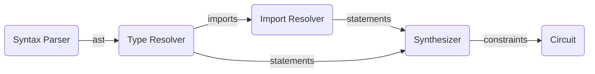

# The Leo Programming Language

## Compiler Architecture

<!-- generated by mermaid compile action - START -->

<details>
  <summary>Mermaid markup</summary>



</details>
<!-- generated by mermaid compile action - END -->

## Language Specification

* Programs should be formatted:
    1. Import definitions
    2. Circuit definitions
    3. Function definitions

## Defining Variables
Leo supports `let` and `const` keywords for variable definition.

```let a = true;``` defines an **allocated** program variable `a` with boolean value `true`.

```const a = true;``` defines a **constant** program variable `a` with boolean value `true`.

**Allocated** variables define private variables in the constraint system. Their value is constrained in the circuit on initialization.

**Constant** variables do not define a variable in the constraint system. Their value is constrained in the circuit on computation with an **allocated** variable. 
**Constant** variables can be mutable. They do not have the same functionality as `const` variables in other languages.
```rust
function addOne() -> {
    let a = 0u8;   // allocated, value enforced on this line
    const b = 1u8; // constant, value not enforced yet

    return a + b   // allocated, computed value is enforced to be the sum of both values
}
```
Computations are expressed in terms of arithmetic circuits, in particular rank-1 quadratic constraint systems. Thus computing on an allocated variable always results in another allocated variable. 

## Mutability
* All defined variables in Leo are immutable by default.
* Variables can be made mutable with the `mut` keyword.

```rust
function main() {
    let a = 0u32;
    //a = 1 <- Will fail
    
    let mut b = 0u32;
    b = 1; // <- Ok
}
```

## Booleans

Explicit types are optional.
```rust
function main() -> bool {
    let a: bool = true || false;
    let b = false && false;
    let c = 1u32 == 1u32;
    return a
}
```

## Numbers
* The definition of a number must include an explicit type.
* After assignment, you can choose to explicitly add the type or let the compiler interpret implicitly.
* Type casting is not supported.
* Comparators are not supported.

### Integers
Supported integer types: `u8`, `u16`, `u32`, `u64`, `u128`
```rust
function main() -> u32 {
    let a = 2u32; // explicit type
    let a: u32 = 1 + 1; // explicit type
    
    let b = a - 1; // implicit type
    let c = b * 4;
    let d = c / 2;
    let e = d ** 3;
    return e
}
```

### Field Elements
```rust
function main() -> field {
    let a = 1000field; // explicit type
    let a: field = 21888242871839275222246405745257275088548364400416034343698204186575808495617; // explicit type
    let b = a + 1; // implicit type
    let c = b - 1; 
    let d = c * 4;
    let e = d / 2;
    return e
}
```

### Affine Points
The set of affine points on the elliptic curve passed into the leo compiler forms a group.
Leo supports this set as a primitive data type.

```rust
function main() -> group {
    let a = 1000group; // explicit type
    let a = (21888242871839275222246405745257275088548364400416034343698204186575808495617, 21888242871839275222246405745257275088548364400416034343698204186575808495617)group; // explicit type
    let b = a + 0; // implicit type
    let c = b - 0; 
    return c
}
```

### Operator Assignment Statements
```rust
function main() -> u32 {
  let mut a = 10;
  a += 5;
  a -= 10;
  a *= 5;
  a /= 5;
  a **= 2;

  return a
}
```

## Arrays
Leo supports static arrays with fixed length.
```rust
function main() -> u32[2] {
    // initialize an integer array with integer values
    let mut a: u32[3] = [1, 2, 3];

    // set a mutable member to a value
    a[2] = 4;

    // initialize an array of 4 values all equal to 42
    let b = [42u8; 4];

    // initialize an array of 5 values copying all elements of b using a spread
    let c = [1, ...b];

    // initialize an array copying a slice from `c`
    let d = c[1..3];

    // initialize a field array
    let e = [5field; 2];

    // initialize a boolean array
    let f = [true, false || true, true];

    return d
}
```

### Multidimensional Arrays
```rust
function main() -> u32[3][2] {
  let m = [[0u32, 0u32], [0u32, 0u32]];

  let m: u32[3][2] = [[0; 3]; 2];

  return m
}
```

## Conditionals

Branching in Leo is different than traditional programming languages. Leo developers should keep in mind that every program compiles to a circuit which represents
all possible evaluations.

### If Else Ternary Expression
Ternary `if [cond] ? [first] : [second];` expressions are the cheapest form of conditional. 
Since `first` and `second` are expressions, we can resolve their values before proceeding execution.
In the underlying circuit, this is a single bit multiplexer.

```rust
function main() -> u32 {
  let y = if 3==3 ? 1 : 5;
  return y
}
```

### If Else Conditional Statement
Leo supports the traditional `if [cond] { [first] } else { [second] }` which can be chained using `else if`.
Since `first` and `second` are one or more statements, they resolve to separate circuits which will all be evaluated.
In the underlying circuit this can be thought of as a demultiplexer.
```rust
function main(a: bool, b: bool) -> u32 {
  let mut res = 0u32;
  if a {
    res = 1;
  } else if b {
    res = 2;
  } else {
    res = 3;
  }
  return res
}
```

### For loop
```rust
function main() -> fe {
  let mut a = 1field;
  for i in 0..4 {
    a = a + 1;
  }
  return a
}
```

## Functions
```rust
function test1(a : u32) -> u32 {
  return a + 1
}

function test2(b: fe) -> field {
  return b * 2field
}

function test3(c: bool) -> bool {
  return c && true
}

function main() -> u32 {
  return test1(5)
}
```


### Function Scope
```rust
function foo() -> field {
  // return myGlobal <- not allowed
  return 42field
}

function main() -> field {
  let myGlobal = 42field;
  return foo()
}
```

### Multiple returns
Functions can return tuples whose types are specified in the function signature.
```rust
function test() -> (u32, u32[2]) {
    return 1, [2, 3]
}

function main() -> u32[3] {
    let (a, b) = test();
    // (a, u32[2] b) = test() <- explicit type also works
    return [a, ...b]
}
```

### Function inputs
Main function inputs are allocated private variables in the program's constraint system.
`a` is implicitly private.
```rust
function main(a: field) -> field {
  return a
}
```
Normal function inputs are passed by value.
```rust
function test(mut a: u32) {
    a = 0;
}

function main() -> u32 {
    let a = 1;
    test(a);

    return a // <- returns 1
}
```

## Circuits
Circuits in Leo are similar to classes in object oriented langauges. Circuits are defined above functions in a Leo program.  Circuits can have one or more members.


Members can be defined as fields which hold primitive values
```rust
circuit Point {
    x: u32
    y: u32
}
function main() -> u32 {
    let p = Point {x: 1, y: 0};
    return p.x
}
```

Members can also be defined as functions.
```rust
circuit Circ {
  function echo(x: u32) -> u32 {
    return x
  }
}

function main() -> u32 {
  let c = Circ { };
  return c.echo(1u32)
}
```

Circuit functions can be made static, enabling them to be called without instantiation.
```rust
circuit Circ {
  static function echo(x: u32) -> u32 {
    return x
  }
}

function main() -> u32 {
  return Circ::echo(1u32)
}
```

The `Self` keyword is supported in circuit functions.
```rust
circuit Circ {
  b: bool

  static function new() -> Self {
    return Self { b: true }
  }
}

function main() -> Circ {
  let c = Circ::new();
  return c.b
}
```

## Imports
Both struct and function imports are supported.

import all: `*`
import alias: `symbol as alias`

`src/simple_import.leo`
```rust
circuit Point {
    x: u32
    y: u32
}

function test() -> (u32, u32[2]) {
    return 1, [2, 3]
}
```

`src/simple.leo`
```rust
from "./simple_import" import {
    Point as Foo,
    test
};

// from "./simple_import" import * 

function main() -> (u32[3]) {
    let p = Foo { x: 1, y: 2};

    let (a, b) = test();

    return [a, ...b]
}
```

## Constraints

### Assert Equals
This will enforce that the two values are equal in the constraint system.

```rust
function main() {
  assert_eq(45, 45);
  
  assert_eq(2fe, 2fe);
  
  assert_eq(true, true);
}
```

## Testing

Use the `test` keyword to add tests to a leo program. Tests must have 0 function inputs and 0 function returns.

```rust
function main(a: u32) -> u32 {
    return a
}

test function expect_pass() {
  let a = 1u32;

  let res = main(a);

  assert_eq!(res, 1u32);
}

test function expect_fail() {
  assert_eq!(1u8, 0u8);
}
```

# Leo Inputs

Private inputs for a Leo program are specified in the `inputs/` directory. The syntax for an input file is a limited subset of the Leo program syntax. The default inputs file is `inputs/inputs.leo`.

## Sections
A Leo input file is made up of sections. Sections are defined by a section header in brackets followed by one or more input definitions. 

Section headers specify the target file which must have a main function with matching input names and types.

`inputs/inputs.leo`

```rust
[main] // <- section header
a: u32 = 1;
b: u32 = 2;
```

`src/main.leo`

```rust
function main(a: u32, b: u32) -> u32 {
    let c: u32 = a + b;
    return c
}
```

## Input Definitions

### Supported types
```rust
[main]
a: bool  = true;       // <- booleans
b: u8    = 2;          // <- integers
c: field = 0;          // <- fields
d: group = (0, 1)group // <- group tuples
```

### Arrays
```rust
[main]
a: u8[4]    = [0u8; 4];      // <- single
b: u8[2][3] = [[0u8; 2]; 3]; // <- multi-dimensional
```

# Leo CLI

## Develop

### `leo new`

To setup a new package, run:
```
leo new {$NAME}
```
This will create a new directory with a given package name. The new package will have a directory structure as follows:
```
- inputs # Your program inputs
    - inputs.leo # Your program inputs for main.leo
- outputs # Your program outputs
- src
    - lib.leo # Your program library
    - main.leo # Your program
- tests
    - test.leo # Your program tests
- Leo.toml # Your program manifest
```

### `leo init`

To initialize an existing directory, run:
```
leo init
```
This will initialize the current directory with the same package directory setup.

### `leo build`

To compile your program and verify that it builds properly, run:
```
leo build
```

### `leo test`

To execute unit tests on your program, run:
```
leo test
```
The results of test compilation and the constraint system will be printed:
```
 INFO  leo  Running 2 tests
 INFO  leo  test language::expect_pass compiled. Constraint system satisfied: true
ERROR  leo  test language::expect_fail errored: Assertion 1u8 == 0u8 failed
```

## Run

### `leo setup`

To perform the program setup, producing a proving key and verification key, run:
```
leo setup
```
Leo uses cryptographic randomness from your machine to perform the setup. The proving key and verification key are stored in the `target` directory as `.leo.pk` and `.leo.vk`:

```
{$LIBRARY}/target/{$PROGRAM}.leo.pk
{$LIBRARY}/target/{$PROGRAM}.leo.vk
```

### `leo prove`

To execute the program and produce an execution proof, run:
```
leo prove
```
Leo starts by checking the `target` directory for an existing `.leo.pk` file. If it doesn't exist, it will proceed to run `leo setup` and then continue.

Next any input files in the `inputs` directory are parsed and all input values are passed to the program.

Once again, Leo uses cryptographic randomness from your machine to produce the proof. The proof is stored in the `target` directory as `.leo.proof`:

```
{$LIBRARY}/target/{$PROGRAM}.leo.proof
```

### `leo verify`

To verify the program proof, run:
```
leo verify
```
Leo starts by checking the `target` directory for an existing `.leo.proof` file. If it doesn't exist, it will proceed to run `leo prove` and then continue.

After the verifier is run, Leo will output either `true` or `false` based on the verification.

## Remote

To use remote compilation features, start by authentication with:
```
leo login
```
You will proceed to authenticate using your username and password. Next, Leo will parse your `Leo.toml` file for `remote = True` to confirm whether remote compilation is enabled.

If remote compilation is enabled, Leo syncs your workspace so when you run `leo build`, `leo test`, `leo setup` and `leo prove`, your program will run the program setup and execution performantly on remote machines.

This speeds up the testing cycle and helps the developer to iterate significantly faster.

## Publish

To package your program as a gadget and publish it online, run:
```
leo publish
```
Leo will proceed to snapshot your directory and upload your directory to the circuit manager. Leo will verify that `leo build` succeeds and that `leo test` passes without error.

If your gadget name has already been taken, `leo publish` will fail.

## Deploy

To deploy your program to Aleo, run:
```
leo deploy
```

# Install

To install Leo from source, in the root directory of the repository, run:
```
cargo install --path .
```

## TODO

- Change `target` directory to some other directory to avoid collision.
- Figure out how `leo prove` should take in assignments.
- Come up with a serialization format for `.leo.pk`, `.leo.vk`, and `.leo.proof`.
