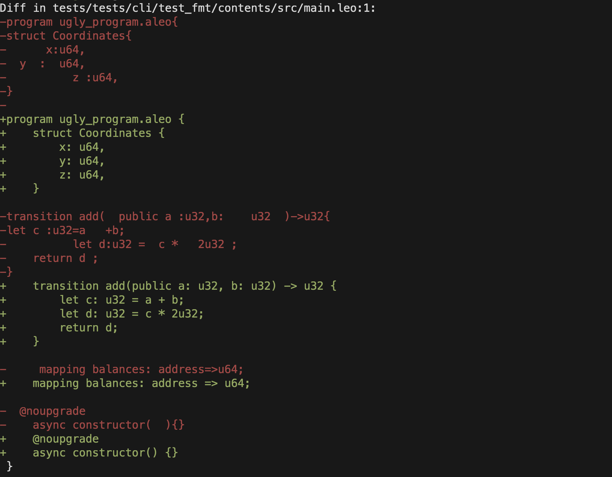

[general tags]: # "cli, leo_fmt, fmt, format, formatting, plugin"

# `leo fmt`

:::info
`leo-fmt` is distributed as a **plugin** rather than a built-in command. When you run `leo fmt`, the Leo CLI delegates to the `leo-fmt` binary on your PATH. You can also invoke `leo-fmt` directly.
:::

Format Leo source files, automatically formatting all `.leo` files in your project.

```bash
leo fmt
```

By default, `leo fmt` formats all `.leo` files in the `src/` directory. There is no output on success.

You can also format specific files or directories:

```bash
leo fmt src/main.leo
```

## Installation

Install `leo-fmt` alongside Leo:

```bash
cargo install leo-fmt
```

Pre-built binaries are available from [Leo releases](https://github.com/ProvableHQ/leo/releases). Release archives include `leo-fmt` alongside the main `leo` binary.

:::note
Plugin distribution is evolving. Tag-triggered releases and `cargo binstall` support are in progress. See [Leo #29355](https://github.com/ProvableHQ/leo/pull/29355) for the latest details.
:::

To verify the plugin is installed and visible to Leo:

```bash
leo plugins
```

## Check Mode

To check if files are formatted without modifying them, use the `--check` flag. This prints a colored diff of any unformatted files and exits with code 1 if changes are needed:

```bash
leo fmt --check
```



### Flags

#### `--check`

#### `-c`

Check if files are formatted without modifying them. Prints a diff and exits with code 1 if any files need formatting.

#### `[PATH]...`

Files or directories to format. Defaults to the project `src/` directory if not specified.
