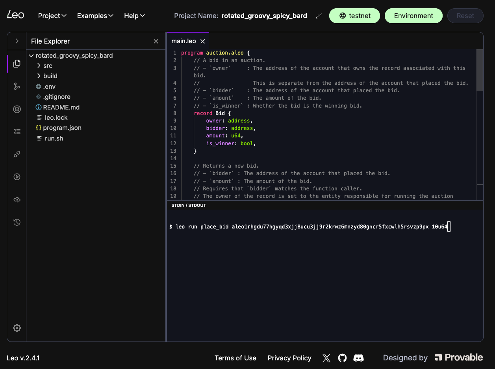

[general tags]: # "playground, ide, plugin"

Developers can choose from a wide variety of development environments.

## Leo Playground

[Leo Playground](https://play.leo-lang.org) is a web-based IDE that is designed to allow developers to develop, deploy, and execute programs all in the browser! It comes with an editor, Github integrations, and a number of utilities to manage programs and interface with the network.

:::note
Developers may find that generating transactions is slower in the browser. This is because the underlying algorithms for generating proofs are computationally expensive. We're actively working on making this better!
:::

## Plugins

<!--TODO: Condense this.--->

The Leo team also maintains a plugin for a number of different editors. If you do not see your favorite editor on this list, please reach out on [GitHub](https://github.com/ProvableHQ/leo/issues/new).

### VS Code

[//]: # ""

Download the editor here: <https://code.visualstudio.com/download>.

#### Install

1. Install [Leo for VSCode](https://marketplace.visualstudio.com/items?itemName=aleohq.leo-extension) from VSCode marketplace.
2. The correct extension ID is `aleohq.leo-extension`, and the description should state "the official VSCode extension for Leo".

#### Usage

1. Open `VSCode`.
2. Go to Settings > Extensions or use the left side panel Extensions button to enable the Leo plugin.

### Sublime Text

[//]: # "  "

Download the editor here: <https://www.sublimetext.com/download>.
Aleo instruction support for Sublime's LSP plugin is provided through a language-server.

#### Install

1. Install [LSP](https://packagecontrol.io/packages/LSP) and [LSP-leo](https://packagecontrol.io/packages/LSP-leo) from Package Control.
2. Restart Sublime.

#### Usage

Follow these steps to toggle the `Leo` syntax highlighting, hover, and tokens.

1. Open `Sublime Text`.
2. From Settings > Select Color Scheme... > LSP-leo

### Intellij

[//]: # ""

Download the editor here: <https://www.jetbrains.com/idea/download/>.

#### Install

1. Install and enable the Leo [plugin](https://plugins.jetbrains.com/plugin/19979-leo) in your IDE.
