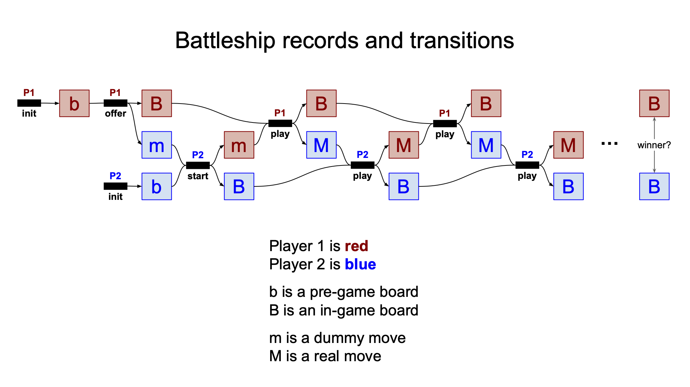

<!-- # Leo Battleship 🏴‍☠️ -->

[//]: # ()

- [Summary](#summary)
- [Build](#how-to-build)
- [Run](#how-to-run)
  - [1. Initializing the Players](#1-initializing-the-players)
  - [2: Player 1 Places Ships On The Board](#2-player-1-places-ships-on-the-board)
  - [3: Player 1 Passes The Board To Player 2](#3-player-1-passes-the-board-to-player-2)
  - [4: Player 2 Places Ships On The Board](#4-player-2-places-ships-on-the-board)
  - [5: Passing The Board Back To Player 1](#5-passing-the-board-back-to-player-1)
  - [6: Player 1 Takes The 1st Turn](#6-player-1-takes-the-1st-turn)
  - [7: Player 2 Takes The 2nd Turn](#7-player-2-takes-the-2nd-turn)
  - [8: Player 1 Takes The 3rd Turn](#8-player-1-takes-the-3rd-turn)
  - [9: Player 2 Takes The 4th Turn](#9-player-2-takes-the-4th-turn)
  - [10. Who Wins?](#10-who-wins)
  - [Graphical Representation](#graphical-representation)
- [ZK Battleship Privacy](#zk-battleship-privacy)
- [Modeling the Boards and Ships](#modeling-the-board-and-ships)
- [Validating a Single Ship](#validating-a-single-ship-at-a-time)
- [Validating all Ships](#validating-all-ships-together-in-a-single-board)
- [Sequencing Game State](#ensure-that-players-and-boards-cannot-swap-mid-game)
- [Preventing Double Moves](#ensure-that-each-player-can-only-move-once-before-the-next-player-can-move)
- [Ensuring Valid Moves](#enforce-constraints-on-valid-moves-and-force-the-player-to-give-their-opponent-information-about-their-opponents-previous-move-in-order-to-continue-playing)
- [Winning](#winning-the-game)

# Summary
Battleship is a game where two players lay their ships into secret configurations on their respective 8x8 grids,
and then take turns firing upon each other's board.
The game ends when one player has sunk all of the other player's ships.

This application was translated into Leo from the [zk-battleship](https://github.com/demox-labs/zk-battleship) example written by the Aleo community - show them some love!

## How to Build

To compile this Leo program, run:
```bash
leo run <function_name> <function_inputs>
```

## How to Run
<details open><summary>Commands and Playing the Game</summary>

### 1. Initializing the Players
In order to play battleship, there must be two players with two boards.
Players will be represented by their Aleo address.
You can use the provided player accounts or [generate your own](https://aleohq.github.io/aleo/).
```markdown
Player 1:
  Private Key  APrivateKey1zkpGKaJY47BXb6knSqmT3JZnBUEGBDFAWz2nMVSsjwYpJmm
     View Key  AViewKey1fSyEPXxfPFVgjL6qcM9izWRGrhSHKXyN3c64BNsAjnA6
      Address  aleo15g9c69urtdhvfml0vjl8px07txmxsy454urhgzk57szmcuttpqgq5cvcdy

Player 2:
  Private Key  APrivateKey1zkp86FNGdKxjgAdgQZ967bqBanjuHkAaoRe19RK24ZCGsHH
     View Key  AViewKey1hh6dvSEgeMdfseP4hfdbNYjX4grETwCuTbKnCftkpMwE
      Address  aleo1wyvu96dvv0auq9e4qme54kjuhzglyfcf576h0g3nrrmrmr0505pqd6wnry
```

Save the keys and addresses. Set the `program.json` private key and address to one of the newly created aleo accounts. We'll refer to this address as Player 1, and the other address as Player 2.

```json
{
    "program": "battleship.aleo",
    "version": "0.0.0",
    "description": "Play ZK Battleship",
    "development": {
        "private_key": "APrivateKey1zkpGKaJY47BXb6knSqmT3JZnBUEGBDFAWz2nMVSsjwYpJmm",
        "view_key": "AViewKey1fSyEPXxfPFVgjL6qcM9izWRGrhSHKXyN3c64BNsAjnA6",
        "address": "aleo15g9c69urtdhvfml0vjl8px07txmxsy454urhgzk57szmcuttpqgq5cvcdy"
    },
    "license": "MIT"
}
```

### 2. Player 1 Places Ships on the Board
Now, we need to make a board as Player 1.
See the [modeling the boards and ships](#modeling-the-board-and-ships) section for information on valid ship bitstrings and placements on the board.
For this example, we will be using sample valid inputs.
Initialize a new board as Player 1 with valid ship inputs and Player 2's address: `leo run initialize_board ship_5_bitstring ship_4_bitstring ship_3_bitstring ship_2_bitstring player_2_address`

**Run**
```
leo run initialize_board 34084860461056u64 551911718912u64 7u64 1157425104234217472u64 aleo1wyvu96dvv0auq9e4qme54kjuhzglyfcf576h0g3nrrmrmr0505pqd6wnry
```
**Output**
```bash
➡️  Output

 • {
  owner: aleo15g9c69urtdhvfml0vjl8px07txmxsy454urhgzk57szmcuttpqgq5cvcdy.private,
  hits_and_misses: 0u64.private,
  played_tiles: 0u64.private,
  ships: 1157459741006397447u64.private,
  player_1: aleo15g9c69urtdhvfml0vjl8px07txmxsy454urhgzk57szmcuttpqgq5cvcdy.private,
  player_2: aleo1wyvu96dvv0auq9e4qme54kjuhzglyfcf576h0g3nrrmrmr0505pqd6wnry.private,
  game_started: false.private,
  _nonce: 3887646704618532506963887075433683846689834495661101507703164090915348189037group.public
}

✅ Executed 'battleship.aleo/initialize_board'
```

The output is a `board_state` record owned by Player 1.
Notice that the `game_started` flag is false, and that the composite ship configuration `ships`
1157459741006397447u64, as a binary bitstring, is `0001000000010000000111111000000010000000100000001000000000000111`,
which laid out in columns and rows is:
```
0 0 0 1 0 0 0 0
0 0 0 1 0 0 0 0
0 0 0 1 1 1 1 1
1 0 0 0 0 0 0 0
1 0 0 0 0 0 0 0
1 0 0 0 0 0 0 0
1 0 0 0 0 0 0 0
0 0 0 0 0 1 1 1
```

### 3: Player 1 Passes The Board To Player 2
Now, we can offer a battleship game to player 2. Run `leo run offer_battleship 'board_state.record'` with the record you just created:
**Run**
```
leo run offer_battleship '{
  owner: aleo15g9c69urtdhvfml0vjl8px07txmxsy454urhgzk57szmcuttpqgq5cvcdy.private,
  hits_and_misses: 0u64.private,
  played_tiles: 0u64.private,
  ships: 1157459741006397447u64.private,
  player_1: aleo15g9c69urtdhvfml0vjl8px07txmxsy454urhgzk57szmcuttpqgq5cvcdy.private,
  player_2: aleo1wyvu96dvv0auq9e4qme54kjuhzglyfcf576h0g3nrrmrmr0505pqd6wnry.private,
  game_started: false.private,
  _nonce: 3887646704618532506963887075433683846689834495661101507703164090915348189037group.public
}'
```

**Output**
```bash
➡️  Outputs

 • {
  owner: aleo15g9c69urtdhvfml0vjl8px07txmxsy454urhgzk57szmcuttpqgq5cvcdy.private,
  hits_and_misses: 0u64.private,
  played_tiles: 0u64.private,
  ships: 1157459741006397447u64.private,
  player_1: aleo15g9c69urtdhvfml0vjl8px07txmxsy454urhgzk57szmcuttpqgq5cvcdy.private,
  player_2: aleo1wyvu96dvv0auq9e4qme54kjuhzglyfcf576h0g3nrrmrmr0505pqd6wnry.private,
  game_started: true.private,
  _nonce: 6563064852163330630334088854834332804417910882908622526775624018226782316843group.public
}
 • {
  owner: aleo1wyvu96dvv0auq9e4qme54kjuhzglyfcf576h0g3nrrmrmr0505pqd6wnry.private,
  incoming_fire_coordinate: 0u64.private,
  player_1: aleo15g9c69urtdhvfml0vjl8px07txmxsy454urhgzk57szmcuttpqgq5cvcdy.private,
  player_2: aleo1wyvu96dvv0auq9e4qme54kjuhzglyfcf576h0g3nrrmrmr0505pqd6wnry.private,
  prev_hit_or_miss: 0u64.private,
  _nonce: 4374626042494973146987320062571809401151262172766172816829659487584978644457group.public
}

✅ Executed 'battleship.aleo/offer_battleship'
```

The first output record is the updated `board_state` record.
Notice the `game_started` flag is now true.
This board cannot be used to offer any other battleship games or accept any battleship game offers.
Player 1 would need to initialize a new board and use that instead.
The second output record is a dummy `move` record --
there are no fire coordinates included to play on Player 2's board,
and no information about any previous Player 2 moves (Player 2 has not made any moves yet).
This `move` record is owned by Player 2, who must use that in combination with their own `board_state` record to accept the game. Let's do that now.

### 4: Player 2 Places Ships On The Board
We must run the program as Player 2 now, so switch the `program.json` file to use Player 2's keys:
```json
{
    "program": "battleship.aleo",
    "version": "0.0.0",
    "description": "Play ZK Battleship",
    "development": {
        "private_key": "APrivateKey1zkp86FNGdKxjgAdgQZ967bqBanjuHkAaoRe19RK24ZCGsHH",
        "view_key": "AViewKey1hh6dvSEgeMdfseP4hfdbNYjX4grETwCuTbKnCftkpMwE",
        "address": "aleo1wyvu96dvv0auq9e4qme54kjuhzglyfcf576h0g3nrrmrmr0505pqd6wnry"
    },
    "license": "MIT"
}
```

We'll create a new and different board for Player 2, and make sure to include Player 1's address as the opponent:
**Run**
```bash
leo run initialize_board 31u64 2207646875648u64 224u64 9042383626829824u64 aleo15g9c69urtdhvfml0vjl8px07txmxsy454urhgzk57szmcuttpqgq5cvcdy
```

**Output**
```bash
➡️  Output

 • {
  owner: aleo1wyvu96dvv0auq9e4qme54kjuhzglyfcf576h0g3nrrmrmr0505pqd6wnry.private,
  hits_and_misses: 0u64.private,
  played_tiles: 0u64.private,
  ships: 9044591273705727u64.private,
  player_1: aleo1wyvu96dvv0auq9e4qme54kjuhzglyfcf576h0g3nrrmrmr0505pqd6wnry.private,
  player_2: aleo15g9c69urtdhvfml0vjl8px07txmxsy454urhgzk57szmcuttpqgq5cvcdy.private,
  game_started: false.private,
  _nonce: 1549419609469324182591325047490602235361156298832591378925133482196483208807group.public
}

✅ Executed 'battleship.aleo/initialize_board'
```

Note, the output ships here is 9044591273705727u64, which in a bitstring is:
```
0 0 1 0 0 0 0 0
0 0 1 0 0 0 1 0
0 0 0 0 0 0 1 0
0 0 0 0 0 0 1 0
0 0 0 0 0 0 1 0
0 0 0 0 0 0 0 0
1 1 1 1 1 1 1 1
```

### 5: Passing The Board Back To Player 1
Now, we can accept Player 1's offer. Run `leo run start_battleship 'board_state.record' 'move.record'`:
**Run**
```bash
leo run start_battleship '{
  owner: aleo1wyvu96dvv0auq9e4qme54kjuhzglyfcf576h0g3nrrmrmr0505pqd6wnry.private,
  hits_and_misses: 0u64.private,
  played_tiles: 0u64.private,
  ships: 9044591273705727u64.private,
  player_1: aleo1wyvu96dvv0auq9e4qme54kjuhzglyfcf576h0g3nrrmrmr0505pqd6wnry.private,
  player_2: aleo15g9c69urtdhvfml0vjl8px07txmxsy454urhgzk57szmcuttpqgq5cvcdy.private,
  game_started: false.private,
  _nonce: 1549419609469324182591325047490602235361156298832591378925133482196483208807group.public
}' '{
  owner: aleo1wyvu96dvv0auq9e4qme54kjuhzglyfcf576h0g3nrrmrmr0505pqd6wnry.private,
  incoming_fire_coordinate: 0u64.private,
  player_1: aleo15g9c69urtdhvfml0vjl8px07txmxsy454urhgzk57szmcuttpqgq5cvcdy.private,
  player_2: aleo1wyvu96dvv0auq9e4qme54kjuhzglyfcf576h0g3nrrmrmr0505pqd6wnry.private,
  prev_hit_or_miss: 0u64.private,
  _nonce: 4374626042494973146987320062571809401151262172766172816829659487584978644457group.public
}'
```

**Outputs**
```bash
➡️  Outputs

 • {
  owner: aleo1wyvu96dvv0auq9e4qme54kjuhzglyfcf576h0g3nrrmrmr0505pqd6wnry.private,
  hits_and_misses: 0u64.private,
  played_tiles: 0u64.private,
  ships: 9044591273705727u64.private,
  player_1: aleo1wyvu96dvv0auq9e4qme54kjuhzglyfcf576h0g3nrrmrmr0505pqd6wnry.private,
  player_2: aleo15g9c69urtdhvfml0vjl8px07txmxsy454urhgzk57szmcuttpqgq5cvcdy.private,
  game_started: true.private,
  _nonce: 6222383571142756260765569201308836492199048237638652378826141459336360362251group.public
}
 • {
  owner: aleo15g9c69urtdhvfml0vjl8px07txmxsy454urhgzk57szmcuttpqgq5cvcdy.private,
  incoming_fire_coordinate: 0u64.private,
  player_1: aleo1wyvu96dvv0auq9e4qme54kjuhzglyfcf576h0g3nrrmrmr0505pqd6wnry.private,
  player_2: aleo15g9c69urtdhvfml0vjl8px07txmxsy454urhgzk57szmcuttpqgq5cvcdy.private,
  prev_hit_or_miss: 0u64.private,
  _nonce: 3742551407126138397717446975757978589064777004441277005584760115236217735495group.public
}

✅ Executed 'battleship.aleo/start_battleship'
```

Notice the outputs here are similar to `offer_battleship`.
A dummy `move` record is owned by Player 1, and Player 2 gets a `board_state` record with the `game_started` flag updated.
However, now that Player 1 has a `move` record and a started board, they can begin to play.

### 6: Player 1 Takes The 1st Turn
**Switch** `program.json`'s keys back to Player 1's.
Player 1 now makes the first real move: `leo run play 'board_state.record' 'move.record' fire_coordinate`

**Run**
```bash
leo run play '{
  owner: aleo15g9c69urtdhvfml0vjl8px07txmxsy454urhgzk57szmcuttpqgq5cvcdy.private,
  hits_and_misses: 0u64.private,
  played_tiles: 0u64.private,
  ships: 1157459741006397447u64.private,
  player_1: aleo15g9c69urtdhvfml0vjl8px07txmxsy454urhgzk57szmcuttpqgq5cvcdy.private,
  player_2: aleo1wyvu96dvv0auq9e4qme54kjuhzglyfcf576h0g3nrrmrmr0505pqd6wnry.private,
  game_started: true.private,
  _nonce: 6563064852163330630334088854834332804417910882908622526775624018226782316843group.public
}' '{
  owner: aleo15g9c69urtdhvfml0vjl8px07txmxsy454urhgzk57szmcuttpqgq5cvcdy.private,
  incoming_fire_coordinate: 0u64.private,
  player_1: aleo1wyvu96dvv0auq9e4qme54kjuhzglyfcf576h0g3nrrmrmr0505pqd6wnry.private,
  player_2: aleo15g9c69urtdhvfml0vjl8px07txmxsy454urhgzk57szmcuttpqgq5cvcdy.private,
  prev_hit_or_miss: 0u64.private,
  _nonce: 3742551407126138397717446975757978589064777004441277005584760115236217735495group.public
}' 1u64
```
**Outputs**
```bash
➡️  Outputs

 • {
  owner: aleo15g9c69urtdhvfml0vjl8px07txmxsy454urhgzk57szmcuttpqgq5cvcdy.private,
  hits_and_misses: 0u64.private,
  played_tiles: 1u64.private,
  ships: 1157459741006397447u64.private,
  player_1: aleo15g9c69urtdhvfml0vjl8px07txmxsy454urhgzk57szmcuttpqgq5cvcdy.private,
  player_2: aleo1wyvu96dvv0auq9e4qme54kjuhzglyfcf576h0g3nrrmrmr0505pqd6wnry.private,
  game_started: true.private,
  _nonce: 1474170213684980843727833284550698461565286563122422722760769547002894080093group.public
}
 • {
  owner: aleo1wyvu96dvv0auq9e4qme54kjuhzglyfcf576h0g3nrrmrmr0505pqd6wnry.private,
  incoming_fire_coordinate: 1u64.private,
  player_1: aleo15g9c69urtdhvfml0vjl8px07txmxsy454urhgzk57szmcuttpqgq5cvcdy.private,
  player_2: aleo1wyvu96dvv0auq9e4qme54kjuhzglyfcf576h0g3nrrmrmr0505pqd6wnry.private,
  prev_hit_or_miss: 0u64.private,
  _nonce: 5481529266389297320813092061136936339861329677911328036818179854958874588416group.public
}

✅ Executed 'battleship.aleo/play'
```

Player 1 has an updated `board_state` record -- they have a new `played_tiles` bitstring,
which corresponds to the fire coordinate they just sent to Player 2.
You can see that the `incoming_fire_coordinate` in the `move` record owned by Player 2 matches exactly the input given by Player 1.
Player 2 can now play this move tile and respond with a fire coordinate of their own,
and they will also let Player 1 know whether their fire coordinate hit or miss Player 2's ships.

### 7: Player 2 Takes The 2nd Turn
**Switch** `program.json` to Player 2's keys. Player 2 makes their move:

**Run**
```bash
leo run play '{
  owner: aleo1wyvu96dvv0auq9e4qme54kjuhzglyfcf576h0g3nrrmrmr0505pqd6wnry.private,
  hits_and_misses: 0u64.private,
  played_tiles: 0u64.private,
  ships: 9044591273705727u64.private,
  player_1: aleo1wyvu96dvv0auq9e4qme54kjuhzglyfcf576h0g3nrrmrmr0505pqd6wnry.private,
  player_2: aleo15g9c69urtdhvfml0vjl8px07txmxsy454urhgzk57szmcuttpqgq5cvcdy.private,
  game_started: true.private,
  _nonce: 6222383571142756260765569201308836492199048237638652378826141459336360362251group.public
}' '{
  owner: aleo1wyvu96dvv0auq9e4qme54kjuhzglyfcf576h0g3nrrmrmr0505pqd6wnry.private,
  incoming_fire_coordinate: 1u64.private,
  player_1: aleo15g9c69urtdhvfml0vjl8px07txmxsy454urhgzk57szmcuttpqgq5cvcdy.private,
  player_2: aleo1wyvu96dvv0auq9e4qme54kjuhzglyfcf576h0g3nrrmrmr0505pqd6wnry.private,
  prev_hit_or_miss: 0u64.private,
  _nonce: 5481529266389297320813092061136936339861329677911328036818179854958874588416group.public
}' 2048u64

```

**Outputs**
```bash
➡️  Outputs

 • {
  owner: aleo1wyvu96dvv0auq9e4qme54kjuhzglyfcf576h0g3nrrmrmr0505pqd6wnry.private,
  hits_and_misses: 0u64.private,
  played_tiles: 2048u64.private,
  ships: 9044591273705727u64.private,
  player_1: aleo1wyvu96dvv0auq9e4qme54kjuhzglyfcf576h0g3nrrmrmr0505pqd6wnry.private,
  player_2: aleo15g9c69urtdhvfml0vjl8px07txmxsy454urhgzk57szmcuttpqgq5cvcdy.private,
  game_started: true.private,
  _nonce: 5254963165391133332409074172682159033621708071536429341861038147524454777097group.public
}
 • {
  owner: aleo15g9c69urtdhvfml0vjl8px07txmxsy454urhgzk57szmcuttpqgq5cvcdy.private,
  incoming_fire_coordinate: 2048u64.private,
  player_1: aleo1wyvu96dvv0auq9e4qme54kjuhzglyfcf576h0g3nrrmrmr0505pqd6wnry.private,
  player_2: aleo15g9c69urtdhvfml0vjl8px07txmxsy454urhgzk57szmcuttpqgq5cvcdy.private,
  prev_hit_or_miss: 1u64.private,
  _nonce: 5851606198769770675504009323414373017067582072428989801313256693053765675198group.public
}

✅ Executed 'battleship.aleo/play'
```

Player 2 now has an updated `board_state` record which includes their newly updated `played_tiles`,
only containing the fire coordinate they just sent to Player 1.
Player 1 now owns a new `move` record which includes the `prev_hits_and_misses` component.
This contains only the result of Player 1's previous fire coordinate they had sent to Player 2.
It will always be a single coordinate on the 8x8 grid if it's a hit. A miss is 0u64 (8x8 grid of 0s),
whereas a hit is the u64 equivalent of their previous fire coordinate in bitstring form.
If you check Player 2's ships configuration, you'll note their entire bottom row is covered by two ships,
so sample valid hits on the bottom row would be: 1u64, 2u64, 4u64, 8u64, 16u64, 32u64, 64u64, and 128u64.
Since Player 1's first fire coordinate (1u64) was a hit, the `prev_hits_and_misses` component is also 1u64.

Player 1's next move will consume this `move` record, which will update Player 1's board with the hit-or-miss,
as well as figure out the result of Player 2's fire coordinate.
Now that Player 1 has some `played_tiles`, they can no longer choose an already-played fire coordinate.
For example, running `aleo run play 'board_state.record' 'move.record' 1u64` will fail, because 1u64 has already been played.

### 8: Player 1 Takes The 3rd Turn
**Switch** `program.json` to use Player 1's keys.

**Run**
```bash
leo run play '{
  owner: aleo15g9c69urtdhvfml0vjl8px07txmxsy454urhgzk57szmcuttpqgq5cvcdy.private,
  hits_and_misses: 0u64.private,
  played_tiles: 1u64.private,
  ships: 1157459741006397447u64.private,
  player_1: aleo15g9c69urtdhvfml0vjl8px07txmxsy454urhgzk57szmcuttpqgq5cvcdy.private,
  player_2: aleo1wyvu96dvv0auq9e4qme54kjuhzglyfcf576h0g3nrrmrmr0505pqd6wnry.private,
  game_started: true.private,
  _nonce: 1474170213684980843727833284550698461565286563122422722760769547002894080093group.public
}' '{
  owner: aleo15g9c69urtdhvfml0vjl8px07txmxsy454urhgzk57szmcuttpqgq5cvcdy.private,
  incoming_fire_coordinate: 2048u64.private,
  player_1: aleo1wyvu96dvv0auq9e4qme54kjuhzglyfcf576h0g3nrrmrmr0505pqd6wnry.private,
  player_2: aleo15g9c69urtdhvfml0vjl8px07txmxsy454urhgzk57szmcuttpqgq5cvcdy.private,
  prev_hit_or_miss: 1u64.private,
  _nonce: 5851606198769770675504009323414373017067582072428989801313256693053765675198group.public
}' 2u64
```

**Outputs**
```bash
➡️  Outputs

 • {
  owner: aleo15g9c69urtdhvfml0vjl8px07txmxsy454urhgzk57szmcuttpqgq5cvcdy.private,
  hits_and_misses: 1u64.private,
  played_tiles: 3u64.private,
  ships: 1157459741006397447u64.private,
  player_1: aleo15g9c69urtdhvfml0vjl8px07txmxsy454urhgzk57szmcuttpqgq5cvcdy.private,
  player_2: aleo1wyvu96dvv0auq9e4qme54kjuhzglyfcf576h0g3nrrmrmr0505pqd6wnry.private,
  game_started: true.private,
  _nonce: 853278652528988609827041334083853520436225751739504321439524466875699631772group.public
}
 • {
  owner: aleo1wyvu96dvv0auq9e4qme54kjuhzglyfcf576h0g3nrrmrmr0505pqd6wnry.private,
  incoming_fire_coordinate: 2u64.private,
  player_1: aleo15g9c69urtdhvfml0vjl8px07txmxsy454urhgzk57szmcuttpqgq5cvcdy.private,
  player_2: aleo1wyvu96dvv0auq9e4qme54kjuhzglyfcf576h0g3nrrmrmr0505pqd6wnry.private,
  prev_hit_or_miss: 0u64.private,
  _nonce: 710336412388939616658264778971886770861024495941253598683184288448156545822group.public
}

✅ Executed 'battleship.aleo/play'
```

As before, both a `board_state` record and `move` record are created.
The `board_state` record now contains 3u64 as the `played_tiles`, which looks like this in bitstring form:
```
0 0 0 0 0 0 0 0
0 0 0 0 0 0 0 0
0 0 0 0 0 0 0 0
0 0 0 0 0 0 0 0
0 0 0 0 0 0 0 0
0 0 0 0 0 0 0 0
0 0 0 0 0 0 0 0
0 0 0 0 0 0 1 1
```

The `board_state` record `hits_and_misses` component has also been updated with the result of their previous move. The new `move` record owned by Player 2 now contains information about whether Player 2's previous move was a hit or miss, as well as Player 1's new fire coordinate.

### 9: Player 2 Takes The 4th Turn
**Switch** `program.json`'s keys to Player 2. Player 2 makes their next move:

**Run**
```bash
leo run play '{
  owner: aleo1wyvu96dvv0auq9e4qme54kjuhzglyfcf576h0g3nrrmrmr0505pqd6wnry.private,
  hits_and_misses: 0u64.private,
  played_tiles: 2048u64.private,
  ships: 9044591273705727u64.private,
  player_1: aleo1wyvu96dvv0auq9e4qme54kjuhzglyfcf576h0g3nrrmrmr0505pqd6wnry.private,
  player_2: aleo15g9c69urtdhvfml0vjl8px07txmxsy454urhgzk57szmcuttpqgq5cvcdy.private,
  game_started: true.private,
  _nonce: 5254963165391133332409074172682159033621708071536429341861038147524454777097group.public
}' '{
  owner: aleo1wyvu96dvv0auq9e4qme54kjuhzglyfcf576h0g3nrrmrmr0505pqd6wnry.private,
  incoming_fire_coordinate: 2u64.private,
  player_1: aleo15g9c69urtdhvfml0vjl8px07txmxsy454urhgzk57szmcuttpqgq5cvcdy.private,
  player_2: aleo1wyvu96dvv0auq9e4qme54kjuhzglyfcf576h0g3nrrmrmr0505pqd6wnry.private,
  prev_hit_or_miss: 0u64.private,
  _nonce: 710336412388939616658264778971886770861024495941253598683184288448156545822group.public
}' 4u64
```

**Outputs**
```bash
➡️  Outputs

 • {
  owner: aleo1wyvu96dvv0auq9e4qme54kjuhzglyfcf576h0g3nrrmrmr0505pqd6wnry.private,
  hits_and_misses: 0u64.private,
  played_tiles: 2052u64.private,
  ships: 9044591273705727u64.private,
  player_1: aleo1wyvu96dvv0auq9e4qme54kjuhzglyfcf576h0g3nrrmrmr0505pqd6wnry.private,
  player_2: aleo15g9c69urtdhvfml0vjl8px07txmxsy454urhgzk57szmcuttpqgq5cvcdy.private,
  game_started: true.private,
  _nonce: 1145182747531998766752104305052328886102707397061849372000385383229513301534group.public
}
 • {
  owner: aleo15g9c69urtdhvfml0vjl8px07txmxsy454urhgzk57szmcuttpqgq5cvcdy.private,
  incoming_fire_coordinate: 4u64.private,
  player_1: aleo1wyvu96dvv0auq9e4qme54kjuhzglyfcf576h0g3nrrmrmr0505pqd6wnry.private,
  player_2: aleo15g9c69urtdhvfml0vjl8px07txmxsy454urhgzk57szmcuttpqgq5cvcdy.private,
  prev_hit_or_miss: 2u64.private,
  _nonce: 5958326936461495382488152485080596366937963499216527548334225566230682598418group.public
}

✅ Executed 'battleship.aleo/play'
```

### 10. Who Wins?
Play continues back and forth between Player 1 and Player 2.
When one player has a total of 14 flipped bits in their `hits_and_misses` component on their `board_state` record,
they have won the game.

### Graphical Representation

The following diagram depicts the records and transitions in a game.



</details>

## ZK Battleship Privacy

How can we ensure that the ship configurations of each player remains secret,
while being able to trustlessly and fairly play with their opponent?
By taking advantage of selective privacy powered by zero-knowledge proofs on Aleo.

Broadly speaking, we can follow this general strategy:

1. Create mathematical rules for placing the ships on the board, to ensure that neither player can cheat by stacking all their ships in one place, moving them off the board, or laying them across each other.

2. Ensure that the players and boards that begin a game cannot be swapped out.

3. Ensure that each player can only move once before the next player can move.

4. Enforce constraints on valid moves, and force the player to give their opponent information about their opponent's previous move in order to continue playing.

## Modeling the board and ships

Most battleship representations in programs use a 64-character string or an array of arrays (8 arrays of 8 elements each) to model the board state. Unfortunately, Leo doesn't represent strings well yet. Luckily for us, Leo has the unsigned 64-bit integer type, `u64`. To represent every space on a battleship board, from top left to bottom right, we can use each bit in a `u64`. For example, an empty board would be:
0u64 =
```
0 0 0 0 0 0 0 0
0 0 0 0 0 0 0 0
0 0 0 0 0 0 0 0
0 0 0 0 0 0 0 0
0 0 0 0 0 0 0 0
0 0 0 0 0 0 0 0
0 0 0 0 0 0 0 0
0 0 0 0 0 0 0 0
```

Battleship is played with 4 different ship types -- a ship of length 5, length 4, length 3, and length 2. Some versions of battleship have an extra length 3 ship or another extra ship type; however, we will stick to the most basic version for this project. In order to be a valid ship placement, a ship must be placed vertically or horizontally (not diagonally). On a physical board, a ship cannot break across rows or intersect with another ship, but ships are allowed to touch one another.

Similar to how we represent a board with a `u64` bitstring, we can represent a ship horizontally as a bitstring. We "flip" the bits to represent a ship:
| Length | Bitstring | u64 |
| ------ | --------- | --- |
| 5 | 11111 | 31u64|
| 4 | 1111  | 15u64|
| 3 | 111   | 7u64 |
| 2 | 11    | 3u64 |

We can also represent a ship vertically as a bitstring. To show this, we need 7 "unflipped" bits (zeroes) in between the flipped bits so that the bits are adjacent vertically.
| Length | Bitstring | u64 |
| --- | --- | --- |
| 5 | 1 00000001 00000001 00000001 00000001 | 4311810305u64 |
| 4 | 1 00000001 00000001 00000001          | 16843009u64 |
| 3 | 1 00000001 00000001                   | 65793u64 |
| 2 | 1 00000001                            | 257u64 |

With a board model and ship bitstring models, we can now place ships on a board.

<details><summary>Examples of valid board configurations:</summary>

17870284429256033024u64
```
1 1 1 1 1 0 0 0
0 0 0 0 0 0 0 0
0 0 0 0 0 0 0 1
0 0 0 0 0 0 0 1
1 1 1 1 0 0 0 1
0 0 0 0 0 0 0 0
0 0 0 0 0 0 1 1
0 0 0 0 0 0 0 0
```

16383u64
```
0 0 0 0 0 0 0 0
0 0 0 0 0 0 0 0
0 0 0 0 0 0 0 0
0 0 0 0 0 0 0 0
0 0 0 0 0 0 0 0
0 0 0 0 0 0 0 0
0 0 1 1 1 1 1 1
1 1 1 1 1 1 1 1
```

2157505700798988545u64
```
0 0 0 1 1 1 0 1
1 1 1 1 0 0 0 1
0 0 0 0 0 0 0 0
0 0 0 0 0 0 0 1
0 0 0 0 0 0 0 1
0 0 0 0 0 0 0 1
0 0 0 0 0 0 0 1
0 0 0 0 0 0 0 1
```

</details>

<details><summary>Examples of invalid board configurations:</summary>

Ships overlapping the bottom ship:
67503903u64
```
0 0 0 0 0 0 0 0
0 0 0 0 0 0 0 0
0 0 0 0 0 0 0 0
0 0 0 0 0 0 0 0
0 0 0 0 0 1 0 0
0 0 0 0 0 1 1 0
0 0 0 0 0 1 1 1
0 0 0 1 1 1 1 1
```

Diagonal ships:
9242549787790754436u64
```
1 0 0 0 0 0 0 0
0 1 0 0 0 1 0 0
0 0 1 0 0 0 1 0
0 0 0 1 0 0 0 0
0 0 0 1 1 0 0 0
0 0 1 0 0 0 0 1
0 1 0 0 0 0 1 0
1 0 0 0 0 1 0 0
```

Ships splitting across rows and columns:
1297811850814034450u64
```
0 0 0 1 0 0 1 0
0 0 0 0 0 0 1 0
1 1 0 0 0 0 0 1
0 0 0 0 0 0 0 0
1 0 0 1 0 0 0 1
0 0 0 1 0 0 0 0
0 0 0 1 0 0 1 0
0 0 0 1 0 0 1 0
```
</details>

Given these rules, our strategy will be to validate each individual ship bitstring placement on a board, and then, if all the ships are valid, compose all the positions onto a board and validate that the board with all ships are valid. If each individual ship's position is valid, then all the ships together should be valid unless any overlapping occurs.

## Validating a single ship at a time

To follow along with the code, all verification of ship bitstrings is done in `verify.leo`. We know a ship is valid if all these conditions are met:
If horizontal:
1. The correct number of bits is flipped (a ship of length 5 should not have 6 flipped bits)
2. All the bits are adjacent to each other.
3. The bits do not split a row.

If vertical:
1. The correct number of bits is flipped.
2. All the bits are adjacent to each other, vertically. This means that each flipped bit should be separated by exactly 7 unflipped bits.
3. The bits do not split a column.

If a ship is valid vertically or horizontally, then we know the ship is valid. We just need to check the bit count, check the adjacency of those bits, and make sure those bits do not split a row/column. However, we can't loop through the bit string to count bits, or to make sure those bits don't break across columns. We'll need to turn to special bitwise operations and hacks.

<details><summary>Bit Counting</summary>

See the `bitcount` function to follow along with the code. 50 years ago, MIT AI Laboratory published HAKMEM, which was a series of tricks and hacks to speed up processing for bitwise operations. https://w3.pppl.gov/~hammett/work/2009/AIM-239-ocr.pdf We turned to HAKMEM 169 for bit counting inspiration, although we've tweaked our implementation to be (hopefully) easier to understand. Before diving into details, let's build some intuition.

Let a,b,c,d be either 0 or 1. Given a polynomial 8a + 4b + 2c + d, how do we find the summation of a + b + c + d?
If we subtract subsets of this polynomial, we'll be left with the summation.
Step 1:  8a + 4b + 2c + d
Step 2: -4a - 2b -  c
Step 3: -2a -  b
Step 4: - a
Step 5: = a +  b +  c + d
This polynomial is basically a bitwise representation of a number, so given a 4 bit number, e.g. 1011 or 13u64, we can follow these instructions to get the bit count. Step 2 is just subtracting the starting number but shifted to the right once (equivalent to dividing by 2). Step 3 shifts the starting number to the right twice and is subtracted, and Step 4 shifts thrice and is subtracted. Put another way: Start with a 4-digit binary number A, and do `A - (A >> 1) - (A >> 2) - (A >> 3) = B`.
Step 1:  1101 = 13u64
Step 2: -0110 =  6u64
Step 3: -0011 =  3u64
Step 4: -0001 =  1u64
Step 5: =0011 =  3u64

To make this process work for any bit-length number, where the sum of the bits is left in groups of 4 bits, we'll need to use some bit masking, so that the sum of one group of 4 does not interfere with the next group of 4.
With a larger starting number, like 1111 0001 0111 0110, we will need the following bit maskings:
```
For A >> 1, we'll use 0111 0111 0111 .... (in u64, this is 8608480567731124087u64)
For A >> 2, we'll use 0011 0011 0011 .... (in u64, this is 3689348814741910323u64)
For A >> 3, we'll use 0001 0001 0001 .... (in u64, this is 1229782938247303441u64)
```

For example, finding the sums of groups of 4 with a 16-bit number we'll call A to yield the bit sum number B:
```
A:    1111 0001 0111 0110
A>>1: 0111 1000 1011 1011
A>>2: 0011 1100 0101 1101
A>>3: 0001 1110 0010 1110

A>>1: 0111 1000 1011 1011
    & 0111 0111 0111 0111:
      0111 0000 0011 0011

A>>2: 0011 1100 0101 1101
    & 0011 0011 0011 0011:
      0011 0000 0001 0001

A>>3: 0001 1110 0010 1110
    & 0001 0001 0001 0001:
      0001 0000 0000 0000

A - (A>>1 & 0111....) - (A>>2 & 0011....) - (A>>3 & 0001....):
B:    0100 0001 0011 0010
      4    1    3    2
```

The next step is to combine the summation of each of those 4-bit groups into sums of 8-bit groups. To do this, we'll use another bit trick. We will shift this number B to the right by 4 (B >> 4), and add that back to B. Then, we'll apply a bit masking of 0000 1111 0000 1111 .... (in u64, this is 1085102592571150095u64) to yield the sums of bits in groups of 8, a number we'll call C.
```
B:    0100 0001 0011 0010
B>>4: 0000 0100 0001 0011
      0100 0101 0100 0101
      4    5    4    5

apply the bit mask
      0000 1111 0000 1111

C:    0000 0101 0000 0101
      0    5    0    5
```

At this point, we've gone from a bit sum in groups of 4 to bit sums in groups of 8. That's great, but ultimately we want the total sum of bits in the original binary number. The final bit trick is to modulo C by 255. This is 2^8 - 1. For a bit of intuition, consider the number 1 0000 0001. If we take 1 0000 0001 mod 256, we're left with 1. If we take 1 0000 0001 mod 255, we're left with 2. Modding by 255 gives us the amount of bits _beyond_ the first 255 numbers, as 255 is the largest number that can be represented with 8 bits.

A full summary of abbreviated steps to get the bit count, starting with a 64-bit integer A (closely following the `bitcount` function in the `verify.leo` code):
```
let A = unsigned 64-bit integer
let B = A - (A>>1 & 8608480567731124087u64) - (A>>2 & 3689348814741910323u64) - (A>>3 & 1229782938247303441u64)
let C = (B - B>>4) & 1085102592571150095u64
bit count = C mod 255u64
```

</details>

<details><summary>Adjacency Check</summary>

Given a ship's placement on the board and its bitstring representation (horizontally or vertically), we can determine if the bits are adjacent. Follow the `adjacency_check` function in `verify.leo`. Given the ship of length 2, we know its horizontal bitstring is 11 (3u64) and its vertical bitstring is 100000001 (257u64). If on the board, the ship starts at the bottom right corner, its horizontal ship placement string would be:
3u64
```
0 0 0 0 0 0 0 0
0 0 0 0 0 0 0 0
0 0 0 0 0 0 0 0
0 0 0 0 0 0 0 0
0 0 0 0 0 0 0 0
0 0 0 0 0 0 0 0
0 0 0 0 0 0 0 0
0 0 0 0 0 0 1 1
```

Vertical ship placement:
257u64
```
0 0 0 0 0 0 0 0
0 0 0 0 0 0 0 0
0 0 0 0 0 0 0 0
0 0 0 0 0 0 0 0
0 0 0 0 0 0 0 0
0 0 0 0 0 0 0 0
0 0 0 0 0 0 0 1
0 0 0 0 0 0 0 1
```

If we move the ship to the left one column:
Horizontal 6u64
```
0 0 0 0 0 0 0 0
0 0 0 0 0 0 0 0
0 0 0 0 0 0 0 0
0 0 0 0 0 0 0 0
0 0 0 0 0 0 0 0
0 0 0 0 0 0 0 0
0 0 0 0 0 0 0 0
0 0 0 0 0 1 1 0
```

Vertical 514u64
```
0 0 0 0 0 0 0 0
0 0 0 0 0 0 0 0
0 0 0 0 0 0 0 0
0 0 0 0 0 0 0 0
0 0 0 0 0 0 0 0
0 0 0 0 0 0 0 0
0 0 0 0 0 0 1 0
0 0 0 0 0 0 1 0
```

If we move the ship up one row:
Horizontal 768u64
```
0 0 0 0 0 0 0 0
0 0 0 0 0 0 0 0
0 0 0 0 0 0 0 0
0 0 0 0 0 0 0 0
0 0 0 0 0 0 0 0
0 0 0 0 0 0 0 0
0 0 0 0 0 0 1 1
0 0 0 0 0 0 0 0
```

Vertical 65792u64
```
0 0 0 0 0 0 0 0
0 0 0 0 0 0 0 0
0 0 0 0 0 0 0 0
0 0 0 0 0 0 0 0
0 0 0 0 0 0 0 0
0 0 0 0 0 0 0 1
0 0 0 0 0 0 0 1
0 0 0 0 0 0 0 0
```

We can make the observation that the original bitstring is always shifted by an integer amount to get to a new valid position on the board. Therefore, if we take the ship placement bitstring and divide by the ship bitstring (either horizontal or vertical), as long as the remaining number is a power of 2 (2^0, 2^1, 2^2, 2^3...), we know the ship's bits are adjacent.

To ensure that the remaining number is a power of 2, we can use a bit trick. See the bit trick for ensuring a bitstring is a power of 2 section.

In the code, you'll notice one extra step. Dividing a ship placement bitstring by a ship bitstring representation could result in 0, and then subtracting by 1 will result in an underflow. In that case, we know the ship placement is not valid, so we can set a number which is guaranteed to not be a power of 2.
</details>

<details><summary>Splitting a row or column</summary>
Follow the `horizontal_check` function in `verify.leo` to follow the code. Assume all the bits are adjacent (see the adjacency check section). The column case is trivial. We can be certain that if a ship bitstring splits columns, the division of that ship placement bitstring by its ship bitstring representation will not yield a power of 2, and it would have failed the adjacency check.

The horizontal case must be checked because a split row bitstring could still contain a ship with adjacent bits. To make this check easier, we will condense the `64` bitstring into an 8-bit bitstring by taking it modulo 255. If we assume that a bitstring is not splitting a row, then taking the ship placement bitstring modulo 255 will yield an 8-bit valid bitstring. If the original ship placement bitstring is not valid, then we will have an invalid 8-bit bitstring. E.g.:
```
1 1 1 0 0 0 0 0
0 0 0 0 0 0 0 0
0 0 0 0 0 0 0 0
0 0 0 0 0 0 0 0
0 0 0 0 0 0 0 0
0 0 0 0 0 0 0 0
0 0 0 0 0 0 0 0
0 0 0 0 0 0 0 0
```
mod 255 = 11100000 (valid)

```
0 0 0 0 0 0 0 1
1 1 0 0 0 0 0 0
0 0 0 0 0 0 0 0
0 0 0 0 0 0 0 0
0 0 0 0 0 0 0 0
0 0 0 0 0 0 0 0
0 0 0 0 0 0 0 0
0 0 0 0 0 0 0 0
```
mod 255 = 11000001 (invalid)

How do we know the 8 bit bitstring is valid or not? We can simply do an adjacency check, as before.

</details>

<details><summary>Ensuring a bitstring is a power of 2</summary>

Any power of 2 will have a single bit flipped. If we subtract 1 from that number, it will result in a complementary bitstring that, bitwise-ANDed with the original, will always result in 0.

E.g.
```
8:   1000
8-1: 0111
8&7: 0000 == 0

7:   0111
7-1: 0110
7&6: 0110 != 0
```

</details>

## Validating all ships together in a single board

Give individual valid ship position bitstrings, we can combine all these together into a single board using bitwise OR operators. See the `create_board` function in `verify.leo` to follow the code. Once all ships are on the board, we can count the total number of bits, which should be 14 exactly for a ship of length 5, 4, 3, and 2.

## Ensure that players and boards cannot swap mid-game

Board states are represented with the board state record. Each board has a flag indicating whether a game has been started with the board. This flag is set when offering a battleship game to an opponent, or accepting a battleship game from an opponent. Move records are created only in 3 ways:
1. Offering a battleship game creates a dummy move record that sets the two players to the addresses set in the board state record.
2. Accepting a battleship game consumes the first dummy move record and checks that the move record contains the same two players as the board of the player accepting the game. Then, a new dummy move record is created and keeps the same two players.
2. A move record must be consumed in order to play and create the next move record. There's a check to ensure the players in the move record matches the players in the board, and the players in the next move record are automatically set.

The only way moves _not_ matching a board can be combined is if the players begin multiple games with each other. As long as one player is honest and only accepts a single game with a particular opponent, only one set of moves can be played on one board between them.

## Ensure that each player can only move once before the next player can move

A move record must be consumed in order to create the next move record. The owner of the move record changes with each play. Player A must spend a move record in order to create a move record containing their fire coordinate, and that move record will be owned by Player B. Player B must spend that move record in order to create the next move record, which will belong to Player A.

## Enforce constraints on valid moves, and force the player to give their opponent information about their opponent's previous move in order to continue playing

A valid move for a player is a fire coordinate that has only one flipped bit in a u64. We can make sure only one bit is flipped with the powers of 2 bit trick. That single bit must be a coordinate that has not been played by that player before, which we check in `board.leo/update_played_tiles`.

In order to give their next move to their opponent, a player must call the `main.leo/play` function, which checks the opponent's fire coordinate on the current player's board. The move record being created is updated with whether that fire coordinate was a hit or a miss for the opponent.

## Winning the game

Right now, the way to check when a game has been won is to count the number of hits on your `hits_and_misses` component on your `board_state` record. Once you have 14 hits, you've won the game.
